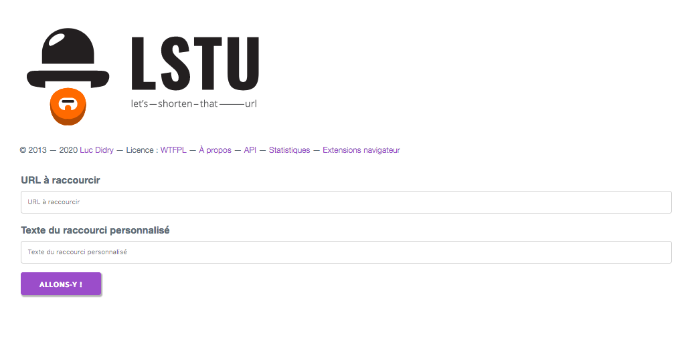

# Lstu for YunoHost

[](https://dash.yunohost.org/appci/app/lstu)    
[](https://install-app.yunohost.org/?app=lstu)

> *This package allows you to install Lstu quickly and simply on a YunoHost server.  
If you don't have YunoHost, please consult [the guide](https://yunohost.org/#/install) to learn how to install it.*

## Overview
Lstu means Let's Shorten That URL.

**Shipped version:** 0.22-0

## Screenshots



## Demo

* [Official demo](https://lstu.fr)

## Configuration

How to configure this app: a plain file at `/var/www/lstu/lstu.conf` with SSH.

## Documentation

 * Official documentation: https://framagit.org/fiat-tux/hat-softwares/lstu/wikis/home

## YunoHost specific features

#### Multi-user support

* Are LDAP and HTTP auth supported? **Yes**  
* Can the app be used by multiple users? **Yes**

#### Supported architectures

* x86-64 - [](https://ci-apps.yunohost.org/ci/apps/lstu/)
* ARMv8-A - [](https://ci-apps-arm.yunohost.org/ci/apps/lstu/)

## Links

 * Report a bug: https://github.com/YunoHost-Apps/lstu_ynh/issues
 * Upstream app repository: https://framagit.org/fiat-tux/hat-softwares/lstu
 * YunoHost website: https://yunohost.org/

---

## Developer info

Please send your pull request to the [testing branch](https://github.com/YunoHost-Apps/lstu_ynh/tree/testing).

To try the testing branch, please proceed like that.
```
sudo yunohost app install https://github.com/YunoHost-Apps/lstu_ynh/tree/testing --debug
or
sudo yunohost app upgrade lstu -u https://github.com/YunoHost-Apps/lstu_ynh/tree/testing --debug
```

## Todo

- [ ] Allow to choose the database (sqlite or PostgreSQL)
- [ ] Allow to choose to use Minion
- [ ] Add CI stuff
